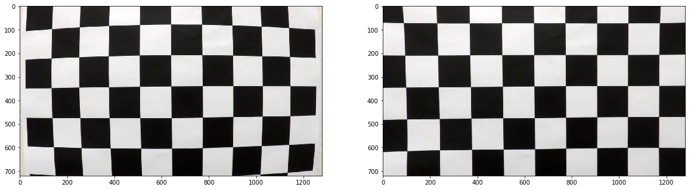
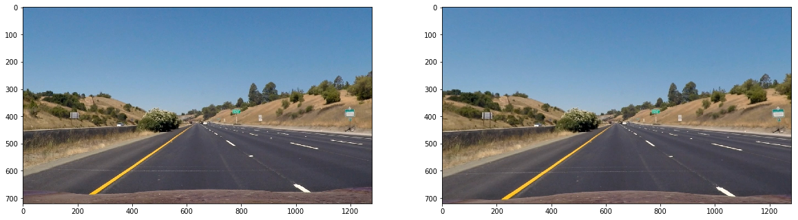
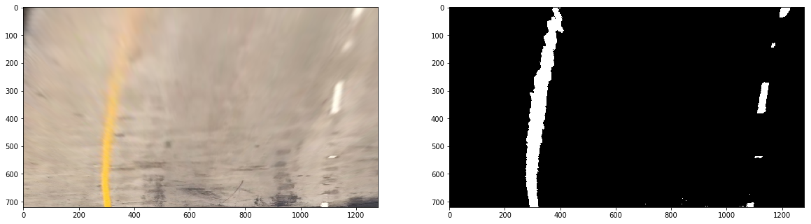
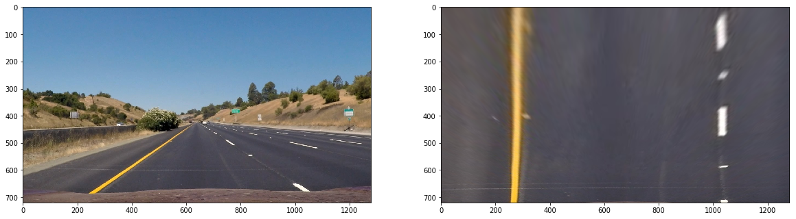
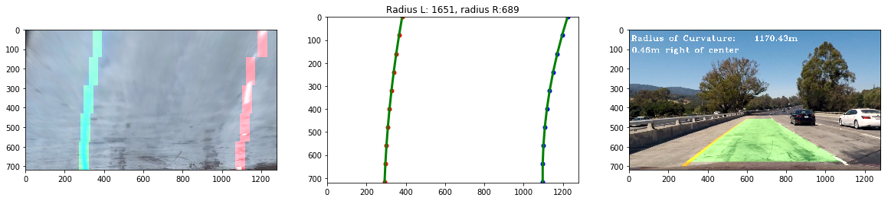
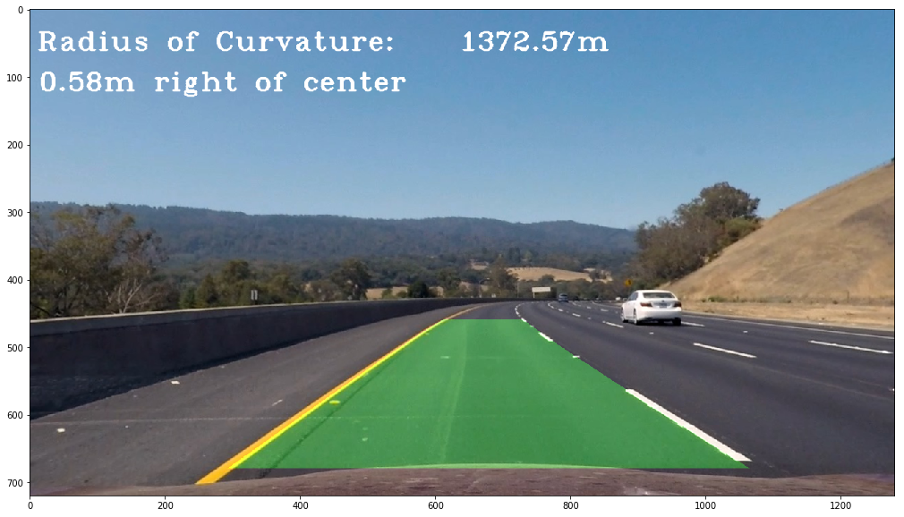

[](https://sdim.gr/RnD/project_video_with_overlay.mp4)

## Advanced Lane Finding Project


The goals / steps of this project are the following:

* Compute the camera calibration matrix and distortion coefficients given a set of chessboard images.
* Apply a distortion correction to raw images.
* Use color transforms, gradients, etc., to create a thresholded binary image.
* Apply a perspective transform to rectify binary image ("birds-eye view").
* Detect lane pixels and fit to find the lane boundary.
* Determine the curvature of the lane and vehicle position with respect to center.
* Warp the detected lane boundaries back onto the original image.
* Output visual display of the lane boundaries and numerical estimation of lane curvature and vehicle position.

[//]: # (Image References)

[image1]: ./examples/undistort_output.png "Undistorted"
[image2]: ./test_images/test1.jpg "Road Transformed"
[image3]: ./examples/binary_combo_example.jpg "Binary Example"
[image4]: ./examples/warped_straight_lines.jpg "Warp Example"
[image5]: ./examples/color_fit_lines.jpg "Fit Visual"
[image6]: ./examples/example_output.jpg "Output"
[video1]: ./project_video.mp4 "Video"

## [Rubric](https://review.udacity.com/#!/rubrics/571/view) Points

### Here I will consider the rubric points individually and describe how I addressed each point in my implementation.  

---

### Writeup / README

#### 1. Provide a Writeup / README that includes all the rubric points and how you addressed each one.  You can submit your writeup as markdown or pdf.  [Here](https://github.com/udacity/CarND-Advanced-Lane-Lines/blob/master/writeup_template.md) is a template writeup for this project you can use as a guide and a starting point.  

You're reading it!

### Camera Calibration

#### 1. Briefly state how you computed the camera matrix and distortion coefficients. Provide an example of a distortion corrected calibration image.

The code for this step starts in the third code cell of the IPython notebook located in "./Advanced Lane Finding Project2.ipynb"   

I start by preparing "object points", which will be the (x, y, z) coordinates of the chessboard corners in the world. Here I am assuming the chessboard is fixed on the (x, y) plane at z=0, such that the object points are the same for each calibration image.  Thus, `objp` is just a replicated array of coordinates, and `objpoints` will be appended with a copy of it every time I successfully detect all chessboard corners in a test image.  `imgpoints` will be appended with the (x, y) pixel position of each of the corners in the image plane with each successful chessboard detection.  

I then used the output `objpoints` and `imgpoints` to compute the camera calibration and distortion coefficients using the `cv2.calibrateCamera()` function.  I applied this distortion correction to the test image using the `cv2.undistort()` function and obtained this result: 




### Pipeline (single images)

#### 1. Provide an example of a distortion-corrected image.

To demonstrate this step, I will describe how I apply the distortion correction to one of the test images like this one:


#### 2. Describe how (and identify where in your code) you used color transforms, gradients or other methods to create a thresholded binary image.  Provide an example of a binary image result.

I used a combination of color and gradient thresholds to generate a binary image (thresholding steps at code cells #15  through #23 in the jupyter notebook).  Here's an example of my output for this step. 

Aside the lesson functions, I created additional functions that use the S channel from the HLS color space and the Y channel from the CMYK color space. The Y channel makes the yellow line easier to filter.



#### 3. Describe how (and identify where in your code) you performed a perspective transform and provide an example of a transformed image.

The code for my perspective transform includes a function called `warper()`, which appears in the code cell #13 in the jupyter notebook.  The `warper()` function takes as inputs an image (`img`), as well as source (`src`) and destination (`dst`) points.  I chose the hardcode the source and destination points in the following manner:

```python
src =np.float32( [[576,461],[707,461],[254,678],[1056,678]])
dst = np.float32([[254,50],[1056,50],[254,719],[1056,719]])
```

This resulted in the following source and destination points:

| Source        | Destination   | 
|:-------------:|:-------------:| 
| 576,461      | 254,50        | 
| 707,461      | 1056,50      |
| 254,678     | 254,719      |
| 1056,678      | 1059,719        |

I verified that my perspective transform was working as expected by drawing the `src` and `dst` points onto a test image and its warped counterpart to verify that the lines appear parallel in the warped image.



#### 4. Describe how (and identify where in your code) you identified lane-line pixels and fit their positions with a polynomial?

I used the convolution method for line detection. It was harder than using the histogram method but it was an interesting challenge.

I improved the code given in the lessons by adding the following features:
* filter out the empty windows. If the max value of a search window is lower than valid_threshold ( = 0) then the window is not added on the list.
* fine tuned the variables (window width, margin, etc)
* Instead of averaging the line coefficients of the last frames, I used the the valid points of the last n frames for np.polyfit. 

Then I did some other stuff and fit my lane lines with a 2nd order polynomial in the Line class, in code cell #46. The result is like this:



#### 5. Describe how (and identify where in your code) you calculated the radius of curvature of the lane and the position of the vehicle with respect to center.

I did this in code cell #46 in the jupyter notebook.
In the update method of the Line() class, the self.radius_of_curvature and self.line_base_pos are calculated

#### 6. Provide an example image of your result plotted back down onto the road such that the lane area is identified clearly.

I implemented this step in code cell #48 in the jupyter notebook  in  in the function `processFrame(image)`.  Here is an example of my result on a test image:



---

### Pipeline (video)

#### 1. Provide a link to your final video output.  Your pipeline should perform reasonably well on the entire project video (wobbly lines are ok but no catastrophic failures that would cause the car to drive off the road!).

Here's a my final video output.
[link to my video result](https://sdim.gr/RnD/project_video_with_overlay.mp4)

---

### Discussion

#### 1. Briefly discuss any problems / issues you faced in your implementation of this project.  Where will your pipeline likely fail?  What could you do to make it more robust?

I used the recommended pipeline with a few improvements
* I used the Y color channel from the CMYK color space to detect the yellow line even when it was blurred
* I filtered out the empty cendroid windows during the window search
 
I could make the pipeline more robust by: 
* filtering the polylines with a PID controller. It is in the next part of the course, I hope I will implement it later. 
* detect frames with different intensity and apply different thresholds for the binary thresholds for each intensity level (bright, normal, dark)
* rebuild not detected centroids by offsetting the centroids of the other line

Dark and light frames are now always correctly detected. The current pipeline filters out a few bad frames but it cannot be applied on a video with many difficult frames.
